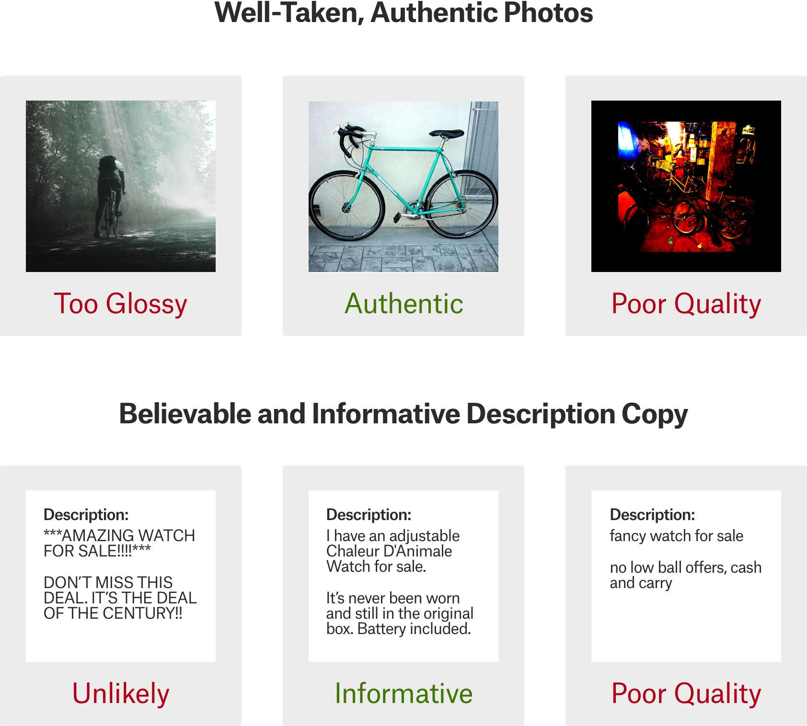
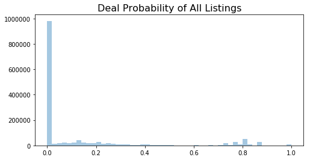
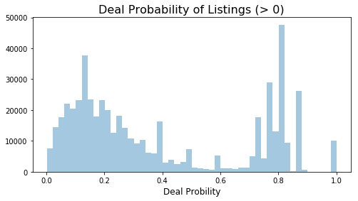
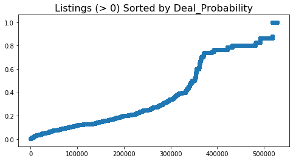
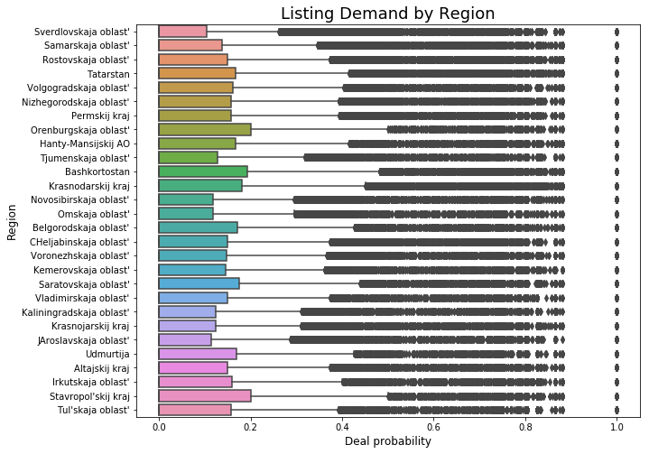
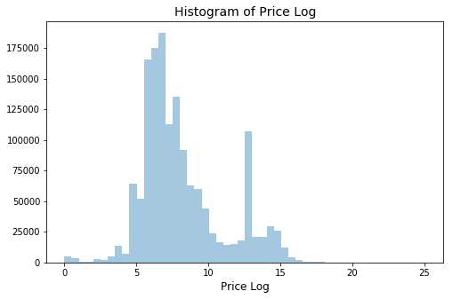

# Deep Learning- Predict Product Demand
---

## 1. Problem

When selling used goods online, a combination of tiny, nuanced details in a product description can make a big difference in drumming up interest.
Details like:



And, even with an optimized product listing, demand for a product may simply not exist–frustrating sellers who may have over-invested in marketing.

Websites for classified advertisements such as Craigslist are deeply familiar with this problem. Sellers may not make the most out of their listings. When a listing has little demand, it may be due to listing deficiencies (bad images, or bad description) or to the product itself (item not historically in demand). On the other hand, a listing with high demand might be underpriced, meaning less profit for the seller.

## 2. Solution

I propose a neural network model that predicts demand for an online advertisement based on its full description (title, description, images, etc.), its context (geographically where it was posted, similar ads already posted) and historical demand for similar ads in similar contexts. This model would inform sellers on how to best optimize their listing and provide some indication of how much interest they should realistically expect to receive.

### 2.1 Challenges

The most challenging part of this project would be dealing with the different kinds of data. NLP would be necessary for parsing titles and descriptions. Aside from common words and possibly LSA components, NLP features might include the count of misspelled words, or the number of total words. Object detection algorithms might identify poor image quality and other problematic cases, such as whether the objects appear too small in the frame (As a consequence of the camera being too far). And image contrast could measure the visibility of products. 

The total size of all data included is 123GB, of which only 2GB are csv files and the rest are images. This presents an obvious challenge. On one hand, using google collab would be convenient for GPU acceleration. On the other hand, that much data isn't storable with a free Google Drive account. Working locally might solve the size issue at the expense of slowing graphics processing. Perhaps we could limit the data to a workable compromise. 

## 3. Use Case

This prediction can be used to inform sellers on how to best optimize their listing and provide some indication of how much interest they should realistically expect to receive. Some online retailers already have implementations of similar models to make suggestions that help sellers. 

Ebay is a notable example of a similar implementation, which gives the seller an "Average Price Range". However, Ebay's implementation only relies on the product title, and only works for common items with plenty of demand such as iPhones and other popular products. The model proposed here would take into account the quality of the images uploaded and the quality of the product description in addition to the context and historical demand for similar products in the platform.

>*An implementation like this is equal to Craigslist on steroids.*

## 4. Data

Avito is a Russian classified advertisements platform similar to Craigslist. They released a dataset including listings with fields such as title, description, location(city & region), price and images. The target variable is the Deal Probability, which is the likelihood that an ad actually sold something. It's not possible to verify every transaction with certainty, so this column's value can be any float from zero to one. In addition, there is supplemental historical data on every listing ID which shows the dates every ad was active on the site.

## 5. Short EDA


```python
import pandas as pd
import matplotlib.pyplot as plt
import seaborn as sns
import numpy as np
import cyrtranslit

color = sns.color_palette()
%matplotlib inline
```

```python
train = pd.read_csv("https://onedrive.live.com/download?cid=62B3CEE436FDB342&resid=62B3CEE436FDB342%21107&authkey=AEh-8Y6p9SC7FK0",
                      compression='zip', parse_dates=["activation_date"])
test = pd.read_csv("https://onedrive.live.com/download?cid=62B3CEE436FDB342&resid=62B3CEE436FDB342%21106&authkey=AAF_zwBmWjNhNGQ",
                      compression='zip', parse_dates=["activation_date"])
```


```python
train.head()
```

<table border="1" class="dataframe">
  <thead>
    <tr style="text-align: right;">
      <th></th>
      <th>item_id</th>
      <th>user_id</th>
      <th>region</th>
      <th>city</th>
      <th>parent_category_name</th>
      <th>category_name</th>
      <th>param_1</th>
      <th>param_2</th>
      <th>param_3</th>
      <th>title</th>
      <th>description</th>
      <th>price</th>
      <th>item_seq_number</th>
      <th>activation_date</th>
      <th>user_type</th>
      <th>image</th>
      <th>image_top_1</th>
      <th>deal_probability</th>
    </tr>
  </thead>
  <tbody>
    <tr>
      <th>0</th>
      <td>b912c3c6a6ad</td>
      <td>e00f8ff2eaf9</td>
      <td>Свердловская область</td>
      <td>Екатеринбург</td>
      <td>Личные вещи</td>
      <td>Товары для детей и игрушки</td>
      <td>Постельные принадлежности</td>
      <td>NaN</td>
      <td>NaN</td>
      <td>Кокоби(кокон для сна)</td>
      <td>Кокон для сна малыша,пользовались меньше месяц...</td>
      <td>400.0</td>
      <td>2</td>
      <td>2017-03-28</td>
      <td>Private</td>
      <td>d10c7e016e03247a3bf2d13348fe959fe6f436c1caf64c...</td>
      <td>1008.0</td>
      <td>0.12789</td>
    </tr>
    <tr>
      <th>1</th>
      <td>2dac0150717d</td>
      <td>39aeb48f0017</td>
      <td>Самарская область</td>
      <td>Самара</td>
      <td>Для дома и дачи</td>
      <td>Мебель и интерьер</td>
      <td>Другое</td>
      <td>NaN</td>
      <td>NaN</td>
      <td>Стойка для Одежды</td>
      <td>Стойка для одежды, под вешалки. С бутика.</td>
      <td>3000.0</td>
      <td>19</td>
      <td>2017-03-26</td>
      <td>Private</td>
      <td>79c9392cc51a9c81c6eb91eceb8e552171db39d7142700...</td>
      <td>692.0</td>
      <td>0.00000</td>
    </tr>
    <tr>
      <th>2</th>
      <td>ba83aefab5dc</td>
      <td>91e2f88dd6e3</td>
      <td>Ростовская область</td>
      <td>Ростов-на-Дону</td>
      <td>Бытовая электроника</td>
      <td>Аудио и видео</td>
      <td>Видео, DVD и Blu-ray плееры</td>
      <td>NaN</td>
      <td>NaN</td>
      <td>Philips bluray</td>
      <td>В хорошем состоянии, домашний кинотеатр с blu ...</td>
      <td>4000.0</td>
      <td>9</td>
      <td>2017-03-20</td>
      <td>Private</td>
      <td>b7f250ee3f39e1fedd77c141f273703f4a9be59db4b48a...</td>
      <td>3032.0</td>
      <td>0.43177</td>
    </tr>
    <tr>
      <th>3</th>
      <td>02996f1dd2ea</td>
      <td>bf5cccea572d</td>
      <td>Татарстан</td>
      <td>Набережные Челны</td>
      <td>Личные вещи</td>
      <td>Товары для детей и игрушки</td>
      <td>Автомобильные кресла</td>
      <td>NaN</td>
      <td>NaN</td>
      <td>Автокресло</td>
      <td>Продам кресло от0-25кг</td>
      <td>2200.0</td>
      <td>286</td>
      <td>2017-03-25</td>
      <td>Company</td>
      <td>e6ef97e0725637ea84e3d203e82dadb43ed3cc0a1c8413...</td>
      <td>796.0</td>
      <td>0.80323</td>
    </tr>
    <tr>
      <th>4</th>
      <td>7c90be56d2ab</td>
      <td>ef50846afc0b</td>
      <td>Волгоградская область</td>
      <td>Волгоград</td>
      <td>Транспорт</td>
      <td>Автомобили</td>
      <td>С пробегом</td>
      <td>ВАЗ (LADA)</td>
      <td>2110</td>
      <td>ВАЗ 2110, 2003</td>
      <td>Все вопросы по телефону.</td>
      <td>40000.0</td>
      <td>3</td>
      <td>2017-03-16</td>
      <td>Private</td>
      <td>54a687a3a0fc1d68aed99bdaaf551c5c70b761b16fd0a2...</td>
      <td>2264.0</td>
      <td>0.20797</td>
    </tr>
  </tbody>
</table>


## Distribution of Target

>There's about a million listings with zero demand, and a much smaller number with varying chance of selling.


```python
# Define deal probabilities and those over zero
probs = train["deal_probability"].values
probs_no0 = probs[probs>0]

# Plot probability histogram
plt.figure(figsize=(8,4))
sns.distplot(probs, kde=False)
plt.title("Deal Probability of All Listings", fontsize=16)
plt.show()

# Probabilities > 0 hist
plt.figure(figsize=(8,4))
sns.distplot(probs_no0, kde=False)
plt.xlabel('Deal Probility', fontsize=12)
plt.title("Deal Probability of Listings (> 0)", fontsize=16)
plt.show()

# Scatter of sorted probs
plt.figure(figsize=(8,4))
plt.scatter(range(probs_no0.shape[0]), np.sort(probs_no0))
plt.title("Listings (> 0) Sorted by Deal_Probability", fontsize=16)
plt.show()
```











## Distribution of Demand by Region

First let's translate the regions from Russian using the `cyrtranslit` package. Then visualize the distribution of each region.


```python
# Get unique regions in cyrilic
cyrilic_regs = train.region.unique().tolist()
# Get unique translations
latin_regs = [cyrtranslit.to_latin(reg,'ru') for reg in cyrilic_regs]

# Put regions in a dictionary
reg_dict = {}
for cyr, lat in zip(cyrilic_regs,latin_regs):
    reg_dict[cyr]=lat
    
# Create a translated list of each region in the dataset
en_list = []
for reg in train.region:
    en_list.append(reg_dict[reg])

# Add english list as column
train['region_en'] = en_list

print('Translation of Russian Regions')
pd.DataFrame(latin_regs[:10],index=cyrilic_regs[:10],columns=['Translations'])
```

    Translation of Russian Regions


<table border="1" class="dataframe">
  <thead>
    <tr style="text-align: right;">
      <th></th>
      <th>Translations</th>
    </tr>
  </thead>
  <tbody>
    <tr>
      <th>Свердловская область</th>
      <td>Sverdlovskaja oblast'</td>
    </tr>
    <tr>
      <th>Самарская область</th>
      <td>Samarskaja oblast'</td>
    </tr>
    <tr>
      <th>Ростовская область</th>
      <td>Rostovskaja oblast'</td>
    </tr>
    <tr>
      <th>Татарстан</th>
      <td>Tatarstan</td>
    </tr>
    <tr>
      <th>Волгоградская область</th>
      <td>Volgogradskaja oblast'</td>
    </tr>
    <tr>
      <th>Нижегородская область</th>
      <td>Nizhegorodskaja oblast'</td>
    </tr>
    <tr>
      <th>Пермский край</th>
      <td>Permskij kraj</td>
    </tr>
    <tr>
      <th>Оренбургская область</th>
      <td>Orenburgskaja oblast'</td>
    </tr>
    <tr>
      <th>Ханты-Мансийский АО</th>
      <td>Hanty-Mansijskij AO</td>
    </tr>
    <tr>
      <th>Тюменская область</th>
      <td>Tjumenskaja oblast'</td>
    </tr>
  </tbody>
</table>

```python
# Boxplots by Region
plt.figure(figsize=(10,8))
sns.boxplot(x="deal_probability", y="region_en", data=train)
plt.xlabel('Deal probability', fontsize=12)
plt.ylabel('Region', fontsize=12)
plt.title("Listing Demand by Region",fontsize=18)
plt.show()
```





- There is a tremendous amount of outliers. Not surprising due to the large size of the data.
- Anything with over 50% chances of selling is an outlier. Based on regional data, expecting a sale is an exception rather than the norm.

## Percentage of Listings per Region


```python
# Get region group counts, sort and divide by N of listings
region_perc = train.groupby('region_en').count().item_id.sort_values(ascending=False)/len(train)

# Top 5 regions
print('Percentage of Listings in Top Regions\n')
print(np.round(region_perc*100,2)[:5])
```

    Percentage of Listings in Top Regions
    
    region_en
    Krasnodarskij kraj        9.41
    Sverdlovskaja oblast'     6.28
    Rostovskaja oblast'       5.99
    Tatarstan                 5.41
    CHeljabinskaja oblast'    5.21
    Name: item_id, dtype: float64


```python
# Visualize sorted listing counts by region
plt.figure(figsize=(10,8))
sns.countplot(data=train,y='region_en',order=region_perc.keys())
plt.title('Count of Listings by Region',fontsize=18)
plt.ylabel('Region EN')
plt.xlabel('Number of Listings')
plt.show()
```


## Listings by City


```python
# Get unique cities in cyrilic
cyrilic_cits = train.city.unique().tolist()
# Get unique translations
latin_cits = [cyrtranslit.to_latin(cit,'ru') for cit in cyrilic_cits]

# Put regions in a dictionary
cit_dict = {}
for cyr, lat in zip(cyrilic_cits,latin_cits):
    cit_dict[cyr]=lat
    
# Create a translated list of each region in the dataset
en_list = []
for cit in train.city:
    en_list.append(cit_dict[cit])

# Add english list as column
train['city_en'] = en_list

print('Translation of Russian Cities (First 10)')
pd.DataFrame(latin_cits[:10],index=cyrilic_cits[:10],columns=['Translations'])
```

    Translation of Russian Cities (First 10)


<table border="1" class="dataframe">
  <thead>
    <tr style="text-align: right;">
      <th></th>
      <th>Translations</th>
    </tr>
  </thead>
  <tbody>
    <tr>
      <th>Екатеринбург</th>
      <td>Ekaterinburg</td>
    </tr>
    <tr>
      <th>Самара</th>
      <td>Samara</td>
    </tr>
    <tr>
      <th>Ростов-на-Дону</th>
      <td>Rostov-na-Donu</td>
    </tr>
    <tr>
      <th>Набережные Челны</th>
      <td>Naberezhnye CHelny</td>
    </tr>
    <tr>
      <th>Волгоград</th>
      <td>Volgograd</td>
    </tr>
    <tr>
      <th>Чистополь</th>
      <td>CHistopol'</td>
    </tr>
    <tr>
      <th>Нижний Новгород</th>
      <td>Nizhnij Novgorod</td>
    </tr>
    <tr>
      <th>Пермь</th>
      <td>Perm'</td>
    </tr>
    <tr>
      <th>Оренбург</th>
      <td>Orenburg</td>
    </tr>
    <tr>
      <th>Ханты-Мансийск</th>
      <td>Hanty-Mansijsk</td>
    </tr>
  </tbody>
</table>


```python
# Get city group counts, sort and divide by N of listings
city_perc = train.groupby('city_en').count().item_id.sort_values(ascending=False)/len(train)

# Top cities
print('Percentage of Listings in Top Cities\n')
print(np.round(city_perc*100,2)[:10])

```

    Percentage of Listings in Top Cities
    
    city_en
    Krasnodar           4.23
    Ekaterinburg        4.23
    Novosibirsk         3.79
    Rostov-na-Donu      3.48
    Nizhnij Novgorod    3.46
    CHeljabinsk         3.22
    Perm'               3.11
    Kazan'              3.10
    Samara              2.79
    Omsk                2.75
    Name: item_id, dtype: float64


- It seems like Russia's two biggest cities are missing. Moscow and Saint Petersburg aren't to be found either in Russian or Latin. The rest of the cities included correspond to the next top 10 biggest cities, by population.


```python
top20_cities = city_perc[:20].keys()

plot_data = train[train['city_en'].isin(top20)]

# Visualize sorted listing counts by region
plt.figure(figsize=(10,8))
sns.countplot(data=plot_data,y='city_en',order=top20_cities)
plt.title('Count of Listings on Cities with Most Ads',fontsize=18)
plt.ylabel('City EN')
plt.xlabel('Number of Listings')
plt.show()
```


## Price Distribution


```python
train['price_fill'] = train.price.fillna(np.mean(train.price)).copy()

plt.figure(figsize=(8,5))
sns.distplot(np.log1p(train.price_fill.values),kde=False)
plt.xlabel('Price Log', fontsize=12)
plt.title("Histogram of Price Log", fontsize=14)
plt.show()
```




